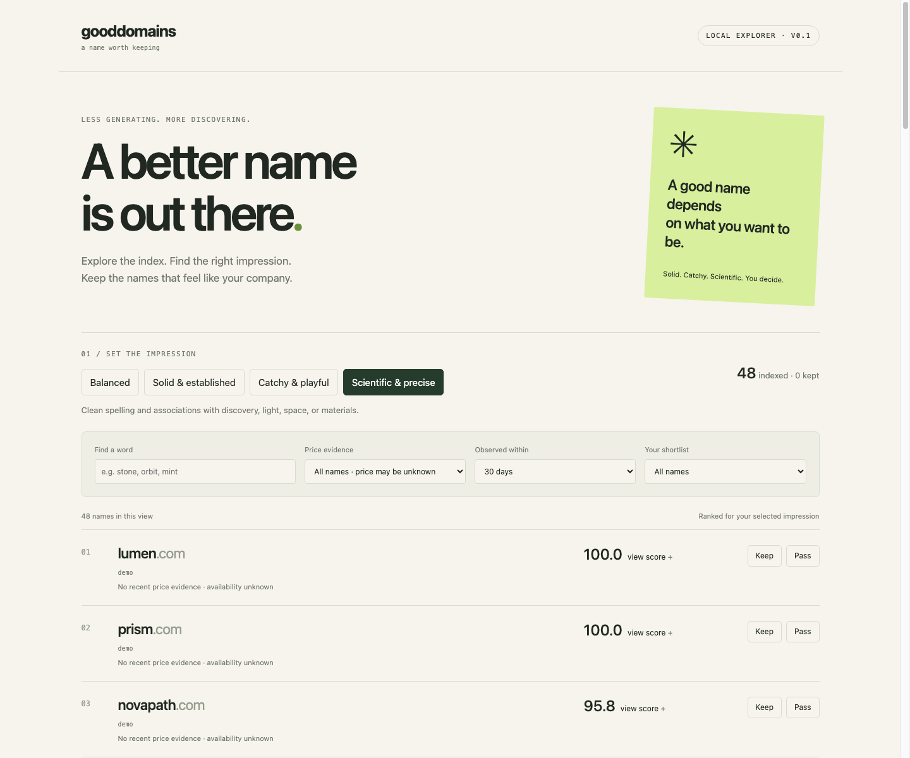

# Gooddomains

**An index for finding a better .com, with rankings you can inspect.**

The interesting question is not “what can we append to this word?” It's “which names could work for this company, and which can we actually acquire?” Gooddomains separates **name quality**, **company impression**, and **purchase evidence**.

This is a working local prototype: Python 3.11+, SQLite, a browser explorer, and no runtime dependencies or API keys. It does not yet contain a large domain corpus or live marketplace connections.

## Run it

```sh
git clone https://github.com/danielstens0n/gooddomains.git
cd gooddomains
python3 -m gooddomains import data/demo.txt --source demo
python3 -m gooddomains serve
```

Open **http://127.0.0.1:8000**. Switch between Balanced, Solid & established, Catchy & playful, and Scientific & precise. Expand a score to inspect its components and source observations. Keep or pass on names; click the selected action again to clear it.

The 48 handwritten demo names are examples, **not availability or sale claims**. Some are existing brands. There are no invented prices. Selecting a price filter on the demo intentionally returns no results.



## What makes a great .com?

A useful working hypothesis:

1. **Low communication cost.** Easy to say, spell after hearing, read, and remember.
2. **The right impression.** A playful consumer product and a scientific instrument company may want very different names.
3. **Enough distinctiveness.** Recognizable without being confusable with competitors; evocative without necessarily describing the product literally.
4. **Room to grow.** The name should survive a broader product line.
5. **A viable acquisition.** A beautiful name with no credible path to ownership is not an actionable recommendation.

These are hypotheses to test with people, not universal laws. “Short” is measurable; “trustworthy” is contextual. The goal is eventually to learn `preference(name A, name B | company brief, audience, language)` and use that to produce a shortlist.

Inspired by the [PG discussion](https://x.com/paulg/status/2104600731361677493) and his earlier [Change Your Name](https://www.paulgraham.com/name.html) essay. The follow-up supplied with this project emphasizes that a name's desired impression depends on the company: solid, catchy, or scientific. The current profiles make that distinction explicit.

## What works today

- Streaming imports of plain domain lists, CSVs, and standard `.com` zone files, including `.gz` inputs.
- Normalization, deduplication, and multiple source observations per name.
- Four deterministic ranking profiles with component values, weights, and explanations.
- Search, pagination, persisted keep/pass decisions, and dated USD asking-price filters.
- A CLI for imports, querying, and rescoring; a loopback-only browser interface.
- Automated importer, ranking, storage, and HTTP tests; GitHub Actions on Python 3.11 and 3.13.

## Import your data

### Existing candidate lists

One second-level ASCII `.com` per line. Blank lines and `#` comments are ignored. Case and a trailing DNS dot are normalized. URLs, subdomains, other TLDs, and internationalized names are rejected in v1.

```sh
python3 -m gooddomains import data/private/candidates.txt --source my-candidates
```

This is how to bring in the output of an existing dictionary generator. Candidate generation is one source, not the whole product.

### Marketplace or broker exports

CSV headers:

```csv
domain,price_usd,observed_at,listing_url
```

`domain` is required. All other fields are optional, except that **a price requires an observation timestamp with timezone**. Prices must be positive numeric USD amounts without `$` or commas. `observed_at` accepts values such as `2026-09-28T12:00:00Z`; use the time the price was actually observed, not the file's import time. `listing_url` must be HTTP(S).

```sh
python3 -m gooddomains import data/private/marketplace.csv --source marketplace-export
python3 -m gooddomains top --profile solid --budget 5000 --days 30
```

Only import data you can legitimately access and use. The app records supplied evidence; it does not independently verify prices. Taxes, transaction fees, installment terms, and negotiation are not modeled. Convert source currencies before importing and retain the original evidence outside this v1 schema.

Each `(domain, source)` stores its **latest observation**, not a full event history. An older timestamp cannot overwrite a newer one. A newer row with a blank price removes that source's previous price. Names missing from a later file are **not** automatically removed or marked unavailable; old prices age out of filters. Use a stable source identifier for repeated imports of the same feed.

### Registry zone files

```sh
python3 -m gooddomains import data/private/com.zone.gz --format zone --source com-zone
```

The importer extracts second-level `.com` NS delegation owners, ignores apex and glue records, and deduplicates through SQLite. It supports `$ORIGIN`, `$TTL`, omitted owners, and multiline SOA records. It is a deliberately limited registry-zone adapter, not a general-purpose DNS parser. Expand `$INCLUDE` and `$GENERATE` before importing; these fail explicitly.

Zone data is a route to broad coverage of delegated domains. [ICANN describes zone-file access and its agreements](https://www.icann.org/resources/pages/zfa-2013-06-28-en); [CZDS](https://czds.icann.org/) directs users to contact the registry when a TLD is not listed. Access may require approval and is subject to the applicable agreement. Do not commit downloaded datasets to the public repository.

**A zone entry does not mean “for sale,” and absence does not mean “available.”** Zone files omit some registered domains, as discussed in [ICANN's SSAC advisory](https://www.icann.org/en/system/files/files/sac-097-en.pdf). Availability checks should eventually run only on shortlisted names through a suitable registrar integration. There is no bulk RDAP crawler here; [Verisign's RDAP terms](https://www.verisign.com/legal-center/rdap-terms/) constrain high-volume automated access.

### Import behavior

Imports stream records and commit every 5,000 records. Accepted observations include duplicates; use `stats` for distinct domain counts. Invalid rows are skipped, the first ten errors are reported, and the command exits with status 2 if any rows were rejected. Fatal parsing or I/O errors exit with status 1. Earlier committed batches remain after an interruption; rerunning is safe for domain/source deduplication. For unpriced rows without `observed_at`, the observation date defaults to import time.

## How ranking works

Scores are weighted sums on a 0–100 scale, stored per profile and sorted descending. Ties break alphabetically. They are **screening heuristics, not probabilities, valuations, or an objective quality scale**.

| Component | Balanced | Solid | Catchy | Scientific | Current proxy |
|---|---:|---:|---:|---:|---|
| Brevity | 25% | 10% | 25% | 10% | Length, with no penalty through five characters |
| Spelling | 25% | 25% | 15% | 25% | Penalizes digits, hyphens, and triple repeated characters |
| Sound | 20% | 10% | 25% | 10% | Vowel groups and long consonant runs |
| Familiarity | 20% | 20% | 5% | 10% | One or two words from a small bundled word list |
| Restraint | 10% | 10% | 5% | 10% | Penalizes possible get/try/use/my wrappers |
| Association | — | 25% | 25% | 35% | Curated tone words recognized in the name |

For example, `anchor.com` ranks above `prism.com` in Solid, and below it in Scientific. These are naming illustrations, not purchase suggestions. Profile scores are comparable **within** a profile, not calibrated across profiles.

The model lives in [gooddomains/ranking.py](gooddomains/ranking.py); the original, hand-curated vocabulary is in [gooddomains/words.txt](gooddomains/words.txt). Edit either and run:

```sh
python3 -m gooddomains rescore
```

The vocabulary is intentionally small and biases rankings toward familiar English nature/material words. Invented names are under-rewarded. Letter patterns cannot establish pronunciation, spelling ambiguity, distinctiveness, meaning in other languages, or audience response. Company briefs, semantic retrieval, trademark checks, and learned preferences are **not implemented**. Keep/pass is currently one global shortlist, not a context-specific training label.

## CLI and development

```sh
python3 -m gooddomains stats
python3 -m gooddomains top --profile scientific --query light --limit 20
python3 -m gooddomains top --review keep > shortlist.json
python3 -m gooddomains --db data/another-index.db import data/demo.txt --source demo
python3 -m gooddomains --db data/another-index.db serve --port 8001
python3 -m unittest discover -s tests -v
```

`--db` goes **before** the subcommand. The default database is `data/gooddomains.db`. Indexes, local environments, and `data/private/` are gitignored. No data leaves the machine during import, ranking, or browsing; opening a source link visits that external site.

Optionally install with `python3 -m pip install -e .` in a virtual environment to use the `gooddomains` command. The source checkout works without installation.

```text
gooddomains/
  ingest.py       streaming text / CSV / zone adapters
  ranking.py      explicit scoring rules and impression profiles
  store.py        SQLite index, source observations, queries, reviews
  cli.py         import, top, stats, rescore, serve
  server.py      loopback HTTP API
  static/        browser explorer (plain HTML, CSS, JS)
data/demo.txt    handwritten examples, no price or availability claims
docs/roadmap.md  data coverage and learning plan
tests/          behavioral and HTTP integration tests
```

The server is for local exploration, with no multiuser authentication or public hosting support. SQLite and streaming imports are a starting point; **full `.com` scale has not been tested**. Profile explanations are stored as JSON and can become storage-heavy. Substring search and counts scan data; large indexes will need measured optimization and a different retrieval layer. See the [roadmap](docs/roadmap.md).

MIT license for the code and authored seed data. External datasets retain their own terms.
